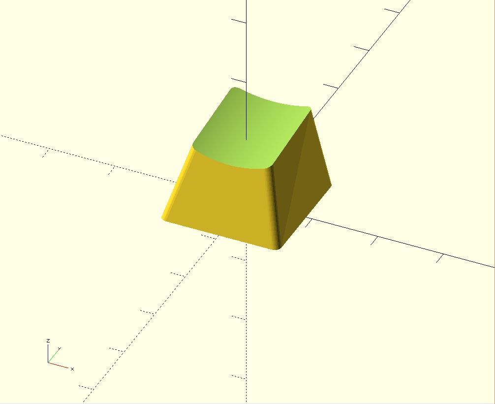
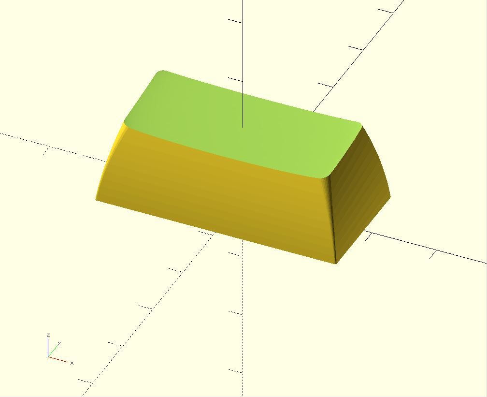
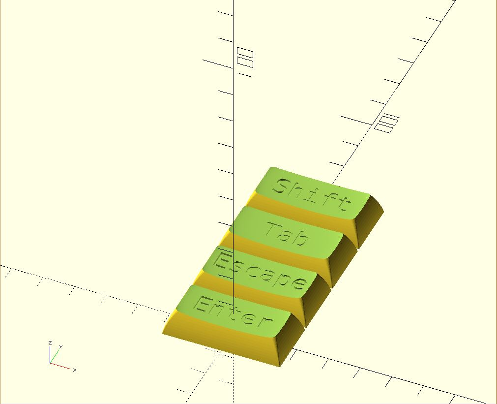
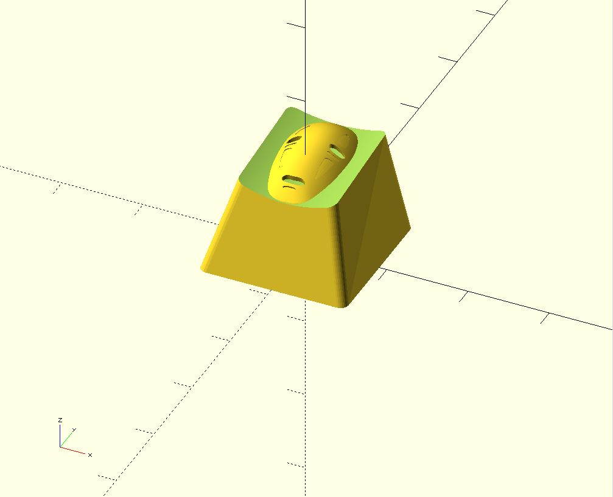
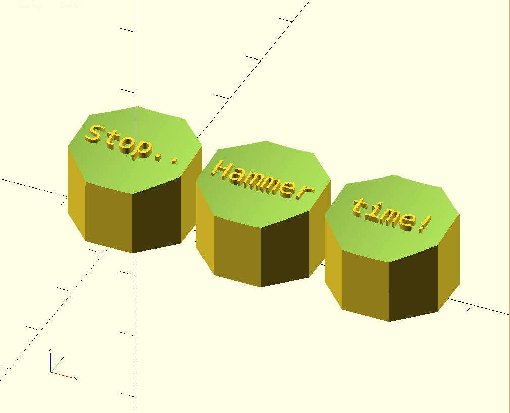

# SDVX Keycaps

Customizable SDVX button/keycap generator based on rsheldiii's "keyV1" project.

## Basics

If you just want to print the keycaps as is, download the models from the `models` folder and slice. For more functionality and customization, read on. 

To run this project, you will need openSCAD. you can download it here: http://www.openscad.org/downloads.html. I highly recommend installing the development snapshot, as they are much further along than the current stable release.

After you have openSCAD installed, you need to download the code and run it. running `git clone https://github.com/sethbaird01/sdvx-keycaps.git` or downloading [this zip](https://github.com/sethbaird01/sdvx-keycaps/archive/master.zip) and extracting the code should do it. 

Then open `SDVX_CENTER.scad`, `SDVX_FX.scad`, and `SDVX_START.scad`. in openSCAD.
To edit the size, bevels, etc, open their respective `SETTINGS` files in a code editor like vscodium. Whenever changed are made, they will be automatically reloaded in openSCAD. 

## Editing
While developing can be done wholly in openSCAD, if you're used to more featureful editors and are doing a lot of changes, you might want to use your favorite code editor. OpenSCAD has a watch mode, 'Automatic Reload and Preview', in the Design menu. With this enabled, OpenSCAD will watch for changes to the file and re-load the preview (F5) automatically. This allows you to minimize the code panel and use your own editor.

All the parameters you may need to edit are in the `SETTINGS` file for each premade key. 
* `$bottom_key_width` is the width in mm for the key.
* `$bottom_key_height` is the height in mm for the key plus 4. (make this value 4 less than your goal mm size. not sure why)
* `$total_depth`, `$stem_throw`, and `$stem_inset` will affect the depth of the key and keytop thickness. Leave these as-is or play around with them to get a taller or shorter keycap. I've found most keyswitches have a throw of 7mm so that should stay the same. 
* `$stem_rotation` rotates the key relative to the stem. By default the `SDVX_START` key has this set to 45degrees for a diamond shape.

## Exporting and printing
Press F6 to render your key in openSCAD, then export to STL through the menus. For keycaps with no dish (default for this repo) I recommend flared support and disabled stem support, then slicing+printing upside down for a flat top surface.

### More on printing

Prints from this library are still challenging, despite all efforts to the contrary. Resin printers can create great looking keycaps; FDM printers can create usable keys that look alright, but may require tweaking to get prints acceptable. There are a few quick things that you can do:

1. If your stem isn't fitting in the switch, try upping the slop factor, accessed by giving your keystem function a numeric value (eg `cherry(0.5) key()`). This will lengthen the cross and decrease the overall size of the keystem. The default value is 0.3, and represents millimeters. Note that even if you have a resin printer, you should probably keep the default value; keys printed with 0 slop will barely fit on the stem.

2. If your keystem breaks off the bed mid-print, you can enable a brim by adding the `brimmed()` modifier. This will give a solid base for the keystem to anchor into.

3. If you are unsatisfied with the quality of the top surface, you can try printing the keycap on a different surface than the bottom, though it may impact the quality of the stem.

4. If your newly-designed key shape is crashing into the switch, you can enable a clearance check for cherry switches by adding `$clearance_check = true;` to your keycap declaration. This will subtract a cherry switch shape from your keycap, highlighting any parts in red which intersect with the switch.

---
<details>
  <summary>Original Project - more info about the library</summary>

### Parametric Mechanical Keycap Library

This library is a keycap and keyset construction library for mechanical keyboards, written in openSCAD.

Relevant links:
* Thingiverse: https://www.thingiverse.com/thing:468651
* Shapeways: https://www.shapeways.com/designer/rsheldiii/creations


#### Making a keycap

At the highest level this library supports Cherry and Alps switches, and has pre-defined key profiles for SA, DSA, DCS, and (some form of) OEM keycaps. `keys.scad` is meant as an entry point for everything but the most technical use; there should already be an example at the bottom to get you started! Pre-programmed key profiles can be found at the `key_profiles` directory.

Every key starts with defaults that are overridden by each function call. The simplest cherry key you can make would be:

```
cherry() key();
```



which is a bog-standard DCS row 5 keycap. To change key profile or make varying width keys, you can use the row and unit length functions, like so:

```
sa_row(2) 2u() cherry() key();
```



#### What if I want to customize my keycaps?

There is a bevy of supporting functions to customize your keycaps. You can add a brim to more easily print the stem, switch up the stem support type, make 2x2 keycaps for a POS system, add legends, rotate stems, and more. These functions can be found in `key_profiles/`, `key_sizes.scad`, `key_transformations.scad`, and `key_types.scad` currently, and can be referenced directly in `keys.scad`.

If you wanted to generate some 2u stabilized keycaps for an Ergodox for instance, you could do something like this:

```
legends = ["Enter", "Escape", "Tab", "Shift"];
for(y=[0:3]) {
  translate_u(0,y) 2u() dsa_row() stabilized() cherry() key(legends[y], inset=true);
}
```



The `key()` function also supports children, and will place them in the center of the top of the keycap, if you want to quickly design your own artisan keycaps:

```
cherry() key() {
  translate([-6.25,2.3,-0]) scale(0.074) import("Assieme1.stl");
};
```



(no face courtesy of [this thing](https://www.thingiverse.com/thing:519727/))

Artisan support also supports _subtracting_ children by doing `key(inset=true) { ... }`, which is super helpful if you want to make keycaps with legends that are not text. The children will be placed just above the middle of the dish as per usual; you will need to translate them downwards (`ex translate([0,0,-1])`) to get them to 'dig in' to the top of the key.

#### What if I want to get _really_ technical?

At the base level this library should function well as a key profile design library. by loading up `src/key.scad` (notice no s) you can tweak variables in `src/settings.scad` to prototype your own profiles. There are currently 44 different settings to tweak in `src/settings.scad` including width height and depth of the keycap, dish tilt, top skew, fonts, wall thickness, etc.

##### What if I want to get even more technical than that?

Now we're talkin!

This library should be abstract enough to handle new dish types, keystems, and key shapes, in case you want to design your own Typewriter-style keycaps, support buckling spring keyboards or design some kind of triangular dished profile. `src/shapes.scad` `src/stems.scad` and `src/dishes.scad` all have a 'selector' module that should allow you to implement your own creations alongside what already exists in their constituent folders.

Here's an example of tweaking the settings and code to make a 'stop sign' key profile:

In `key_shape()` in `shapes.scad`:

```
 else if ($key_shape_type == "stop_sign") {
   stop_sign_shape(size, delta, progress);
 }
```

in `src/shapes/stop_sign.scad`:

```
module stop_sign_shape(size, delta, progress){
  rotate([0,0,22.5]) circle(d=size[0] - delta[0], $fn=8);
}
```

In `keys.scad`:

```
union() {
  // make the font smaller
  $font_size = 3;
  // top of keycap is the same size as the bottom
  $width_difference = 0;
  $height_difference = 0;
  $key_shape_type="stop_sign";
  $dish_type = "cylindrical";
  // some keycap tops are slid backwards a little, and we don't want that
  $top_skew = 0;

  legends = ["Stop..", "Hammer", "time!"];

  for(x=[0:len(legends)-1]) {
    translate_u(x) cherry() key(legends[x]);
  }
}
```



That's it, if you have any questions feel free to open an issue or leave a comment on thingiverse!

#### TODO:
 * switch dishing logic from a super large cube to a bounding box intersection
 * update this documentation!
 * replace linear_extrude_shape_hull with skin_extrude_shape_hull or something, to enable concave extrusions
 * replace current ISO enter shape with one that works for `skin()`
 * generate dishes via math? kind of hard, maybe later

</details>